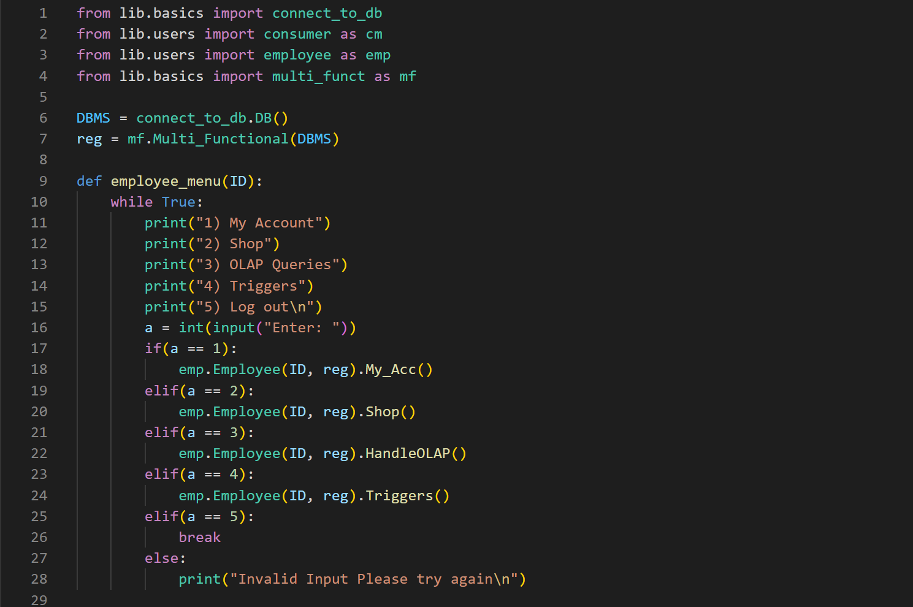
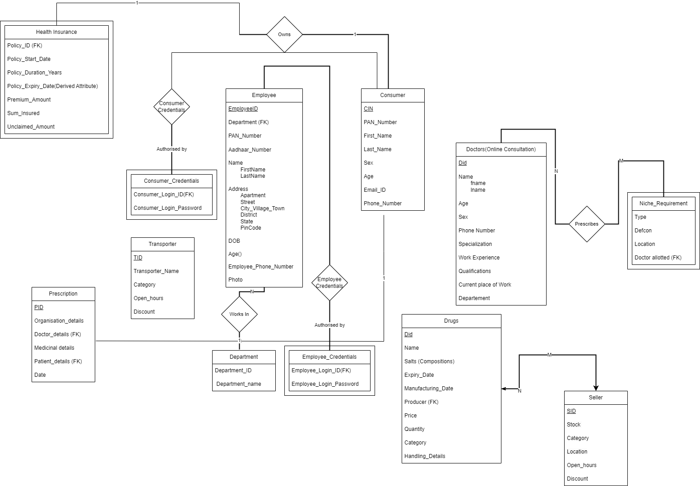

<!-- PROJECT LOGO -->
<br />
<p align="center">
  <a href="https://github.com/Talkative-Banana/Medical-Store">
    
  </a>

  <h3 align="center">Online Medical Store</h3>

  <p align="center">
    An awesome MySQL Database Project for Medical Needs!
    <br />
    <strong>Explore the docs »</strong>
    <br />
    <br />
    <a href="https://github.com/Talkative-Banana/Medical-Store/blob/master/Project_OverView.pdf">View Demo</a>
    ·
    <a href="https://github.com/Talkative-Banana/Medical-Store/issues">Report Bug</a>
    ·
    <a href="https://github.com/Talkative-Banana/Medical-Store/issues">Request Feature</a>
    <br />
</p>

<br>

<!-- TABLE OF CONTENTS -->
<details open="open">
  <summary>Table of Contents</summary>
  <ol>
    <li>
      <a href="#about-the-project">About The Project</a>
      <ul>
        <li><a href="#built-with">Built With</a></li>
      </ul>
    </li>
    <li><a href="#er-diagram">ER Diagram</a></li>
    <li>
      <a href="#getting-started">Getting Started</a>
      <ul>
        <li><a href="#prerequisites">Prerequisites</a></li>
        <li><a href="#installation">Installation</a></li>
      </ul>
    </li>
    <li><a href="#roadmap">Roadmap</a></li>
    <li><a href="#contributing">Contributing</a></li>
    <li><a href="#license">License</a></li>
    <li><a href="#contact">Contact</a></li>
    <li><a href="#acknowledgements">Acknowledgements</a></li>
  </ol>
</details>


<!-- ABOUT THE PROJECT -->
## About The Project

<a href="https://github.com/Talkative-Banana/Medical-Store">
    
</a>

This is an Online Medical Store complete backend project alongwith fully-fledged MySQL database. It contains ER Diagram, Complete Database Dump, Source Code and Project Report. Go and explore the repo :)

### Built With

* [Python](https://www.python.org/)
* [SQL](https://www.w3schools.com/sql)
* [MySQL](https://www.mysql.com/)
* [GitHub](https://github.com)
* [ReactJS](https://react.dev/)

## ER Diagram
<a href="https://github.com/Talkative-Banana/Medical-Store">
    
</a>


<!-- GETTING STARTED -->
## Getting Started

To get a local copy up and running follow these simple steps.

### Prerequisites

1. Basic understanding of Python (Tutorials: [English ](https://youtu.be/_uQrJ0TkZlc)| [Hindi](https://youtu.be/gfDE2a7MKjA))
2. Python installed on your computer ([Download from Here](https://www.python.org/downloads/))
3. GitHub Account ([Sign Up](https://github.com))


### Installation

- Clone the repo
   ```sh
   git clone https://github.com/Talkative-Banana/Medical-Store.git
   ```
- Open the terminal and run `python .\Source_Code\main.py`
   

<!-- ROADMAP -->
## Roadmap

Clone the repo and open it in suitable IDE for complete project source code. You can also fix the issues and hence contribute.


<!-- CONTRIBUTING -->
## Contributing

Contributions are what make the open source community such an amazing place to be learn, inspire, and create. Any contributions you make are **greatly appreciated**.

1. Fork the Project
2. Create your Feature Branch
3. Commit your Changes
4. Push to the Branch
5. Open a Pull Request


<!-- CONTACT -->
## Contact

Email ID - lakshay21059@iiitd.ac.in

<!-- ACKNOWLEDGEMENTS -->
## Acknowledgements
* Lakshay Bansal lakshay21059@iiitd.ac.in
* Naman Rawat naman2021071@iiitd.ac.in
